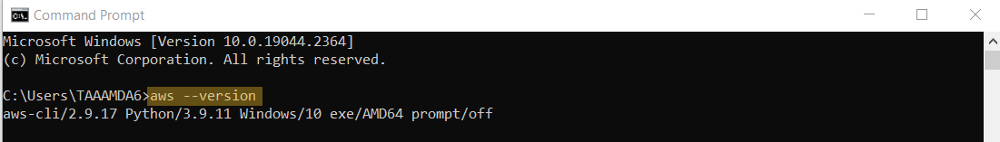

AWS
====

# Ziel

Ziel ist es mit AWS CLI und AWS Cloud Formation eine EC2 Instance mit allem was dazugehört zu deployen. 

# Voraussetzung

** Identity and Access Management (IAM) ein User mit Admin rechten erstellen **
 
 - Gehe zu Webconsole des IAM, wähle Users und erstelle einen neuen User mit AdministratorAccess.
 - Unter "Security Credentionals" clicke auf den Button "Create access key"
 - Wähle Command Line Interface(CLI) aus, bestätige die Empfehlungen und erstelle einen neuen Access Key. 
 - Speichere den Access Key und den Secret Access Key bei dir Lokal ab.

** AWS Command Line Interface download and install **

Download und installiere die [`AWS CLI`](https://aws.amazon.com/cli/)

 CMD Öffnen und Version überprüfen
  `$ aws --version`

# AWS Command Line Interface

  
  **AWS Command Line Interface download and install **
  

  **AWS Command Line Interface Konfigurieren**
  
  > `$ aws configure`

  **AWS Command Line Interface testen**
  
  > `$ aws iam list-users`

## AWS Cloud Formation
- Benutze das CMD um in deinen Project Ordner zu wechseln in welchem das yaml file liegt.

 **Führe folgenden Befehl aus:**
  
  > `$ aws cloudformation create-stack --stack-name ec2-example --template-body file://ec2.yaml --parameters ParameterKey=EnvironmentType,ParameterValue=dev ParameterKey=KeyPairName,ParameterValue=dam-auto`

**You can Update the Stock by using the update-stack command **
  
  > `$ aws cloudformation update-stack --stack-name ec2-example --template-body file://ec2.yaml`

**You can Delete the Stock**
  
  > `$ aws cloudformation delete-stack --stack-name ec2-example`

**You can see the Stacks Process and Errors here**

**Shows the new Stack**
  
  > `$ aws cloudformation describe-stacks`

---

web: [`yaml File`](https://docs.aws.amazon.com/AWSCloudFormation/latest/UserGuide/gettingstarted.templatebasics.html),
web: [`yaml Template`](https://docs.aws.amazon.com/AWSCloudFormation/latest/UserGuide/conditions-sample-templates.html),
web: [`Provisioning`](https://jennapederson.com/blog/2021/6/21/provisioning-an-ec2-instance-with-cloudformation-part-1/),
---

> [⇧ **Zurück zur Hauptseite**](/README.md)

---
