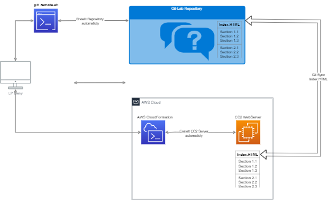

# IaaS (Infrastructure as a Service)

Das Ziel ist möglichst viel zu Automatisieren, vom Git Repository bis zum erstellen eines einfache Webserver mit AWS CloudFormation.

- **Git Repository :** Ein Scirpt erstellen das Automatisch ein Git Repository erstellt 
    - **Template Folder:** Falls gewünscht wird eine Template Strucktur erstellt
    - **Remote Repository** Erstellt eines Remote Repostiory 
    - **Lokalen Repository** Erstellt ein lokales Repostiory 
    - **Global Git Ignore** Erstellt ein .gitignore mit Einträgen 
    - **Git Add** Fügt alle Files hinzu
    - **Git commit** Macht einen ersten Commit
    - **Log File** Erstellt ein Logfile mit Einträgen 
    - **Doku** Script ist ausführlich mit Kommentaren Dokumentiert
- **AWS CloudFormation:** Beschriebung Ziel 
    - **EC2** Erstellt ein EC2 Instance via IaaS
    - **Web Server** Konfiguriert diesen als WebServer 
    - **HTML File** Sync HTML File von Git Repo  

## Architektur Übersicht
 

## Detail Dokumentation

- [**Umsetzung Git**](1_git/README.md)

--- 

- [**Umsetzung AWS**](2_aws/README.md)

---

- [**Umsetzung Webserver**](3_webserver/README.md)

---

- [**Testing**](4_testing/README.md)
  
---

 - **Reflexion**

**Was ist gut gegangen?**

Rückblickend habe ich in diesem kurzen Projekt viel gelernt. 
Ich konnte an meiner Schäche arbeiten und ein Skript erstellen. Das wird mir auch in Zukunft das Leben erleichtern. Dabei habe ich viele einfache Programmiergrundlagen angewendet.

Ich war erstaunt, wie schnell ich mich in die Thematik der YAML-Datei einarbeiten konnte und wie viel sie mit einigen Grundlagen der Programmierung zu tun hat. Allerdings können Kleinigkeiten sehr schnell viel Zeit in Anspruch nehmen. Wie z.B. einen Output String zu erstellen, um direkt eine SSH Verbindung zum Rechner zu ermöglichen.

**Wie könnte man den Service noch verbessern?**
Manchmal musste ich einige Ideen verwerfen, weil ich auf keinen grünen Zweig gekommen bin, wie z.B. die Überprüfung der existierenden Sicherheitsgruppen. Im Moment ist es nicht möglich, eine zweite Instanz mit der Yaml-Datei zu erstellen, da die Sicherheitsgruppe, die erstellt werden soll, bereits existiert. Dies ist sicherlich ein Punkt, der verbessert werden kann.

**Was hat nicht geklappt?**
Um einen Service, z.B. Web, in die Instanz einzubauen, fehlte mir leider die Zeit. 
Ich denke aber, dass dies kein großer Aufwand mehr ist. Der größte Teil des Codes kann von bereits erstellten Projekten übernommen werden. 
Werde das sicherlich noch nachholen.

**Was ist mir aufgefallen?**
Die Nachbearbeitung der Dokumentation hat mich sehr viel Zeit gekostet. 
Es gibt doch eine Reihe von Punkten, die bei der Durchführung des Projektes vergessen worden sind oder die nicht ausführlich genug dokumentiert worden sind. Und die dann, wenn sie nochmals durchgespielt werden,mit viel Zeitaufwand ergänzt werden müssen, so dass alles nachvollziehbar ist.

---

### Fragen?
Gerne ein E-Mail an [Dany Ambühl](mailto://daniel.ambuehl@tbz.ch)

 

---

> [⇧ **Back**](#aktueller-status)

